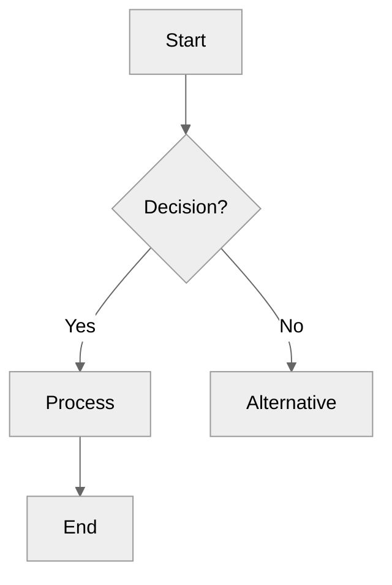
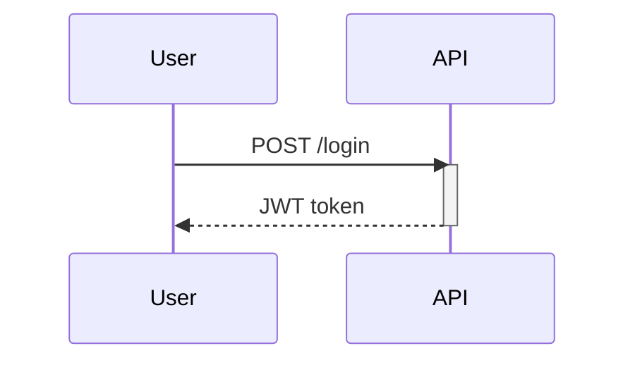

# Mermaid Diagramming Reference

## 1. Core Constraints & Agentic Pitfalls (Cache)
**CRITICAL RULES FOR LLM GENERATION:**
* **Never use lowercase `end` as an ID:** It terminates blocks. Always quote (`"End"`) or capitalize (`END`).
* **Quote Special Characters:** Labels with parentheses, brackets, colons, or commas MUST be quoted: `A["Process (main)"]`.
* **`o`/`x` Prefix Collision:** Add a space to avoid accidental circle/cross edges: `A--- oB` (NOT `A---oB`).
* **Declare the Type:** Every block MUST start with the diagram keyword (`flowchart TD`, `sequenceDiagram`).
* **Model Logic Explicitly:** Do not under-generate. Use decision gateways and parallel branches if the source implies them.
* **Size Limits:** Max ~15 nodes for flowcharts. Split larger systems or use subgraphs.
* **Platform Compatibility:** NO click events or tooltips (they fail on most platforms). NO FontAwesome icons (they fail without site integration). Avoid bleeding-edge beta diagrams if portability matters.
* **Theming:** Use hex colors only (`fill:#ff0000`, not `fill:red`). Prefer `%%{init: {'theme': 'neutral'}}%%` for professional, dark/light mode portable diagrams.

---

## 2. Diagram Syntax & Templates

### Flowcharts


* **Direction:** `TD`/`TB` (top-down), `LR` (left-right), `BT`, `RL`.
* **Nodes:** `[rect]`, `(rounded)`, `{diamond}`, `([pill])`, `[[subroutine]]`, `[(database)]`, `((circle))`, `>flag]`, `{{hexagon}}`, `[/parallelogram/]`, `[\trapezoid\]`, `(((double circle)))`.
* **Edges:** `-->` (solid), `---` (line), `-.->` (dotted), `==>` (thick), `-->|label|` (labeled). Endings: `--o` (circle), `--x` (cross), `<-->` (bidirectional). Length increases with dashes (`--->`).
* **Subgraphs:** `subgraph ID ["Title"] ... end`. Can override direction: `direction LR`.

### Sequence Diagrams



* **Messages:** `->>` (sync), `-->>` (async/response), `-x` (lost), `-)` (async open).
* **Features:** `activate`/`deactivate`, `Note over A,B: text`, `alt`/`else`/`end`, `loop`/`end`, `par`/`and`/`end`, `autonumber`, `actor U as User`.
* **Grouping:** `box Color Name ... end`.

### Class Diagrams

* **Syntax:** `class Name { +Type prop  +method() }`
* **Relations:** `<|--` (inheritance), `*--` (composition), `o--` (aggregation), `-->` (association), `..>` (dependency), `<|..` (realization).
* **Visibility/Modifiers:** `+` (public), `-` (private), `#` (protected), `~` (internal). `$` (static), `*` (abstract). `"1" --> "*"` (cardinality).

### State Diagrams (`stateDiagram-v2`)

* **Syntax:** `[*] --> Idle`, `Idle --> Processing : submit`.
* **Features:** `state "Desc" as s1`, nested states `state Parent { ... }`, `<<fork>>`/`<<join>>`.

### Entity Relationship (`erDiagram`)

* **Syntax:** `USER ||--o{ POST : creates`. Read Left-to-Right.
* **Cardinality:** `||` (exactly 1), `o|` (0 or 1), `}|` (1 or more), `o{` (0 or more).

### Gantt Charts (`gantt`)

* **Format:** `Task Name : <status>, <id>, <start>, <duration/end>`
* **Tags:** `done`, `active`, `crit`, `milestone` (0d duration).
* **Dates:** `dateFormat YYYY-MM-DD`. Start can be `after id1`. Duration `5d`, `12h`.

### Mindmaps (`mindmap`)

* **Syntax:** Hierarchy by strict indentation.
* **Shapes:** Default (rounded), `[Square]`, `((Circle))`, `))Bang((`, `)Cloud(`, `{{Hexagon}}`.

### C4 Diagrams

* **Levels:** `C4Context`, `C4Container`, `C4Component`, `C4Dynamic`.
* **Elements:** `Person(alias, "Label", "Desc")`, `System(...)`, `Container(...)`, `Component(...)`.
* **Boundaries:** `System_Boundary(alias, "Label") { ... }`.
* **Relations:** `Rel(from, to, "Label", "Tech")` (Variants: `Rel_R`, `Rel_L`).

---

## 3. Specialized/Beta Diagrams

*(Note: May not render on older integrations like Obsidian or GitHub.)*

* **Pie:** `pie title Name \n "A" : 45 \n "B" : 25`. Add `showData` for values.
* **Timeline:** `timeline \n title X \n section Y \n Event 1 : Event 2`.
* **Git Graph:** `gitGraph \n commit id: "A" \n branch dev \n checkout dev \n commit \n checkout main \n merge dev`.
* **Quadrant:** `quadrantChart \n x-axis L --> H \n Task A: [0.2, 0.8]`.
* **XY Chart:** `xychart-beta \n x-axis [...] \n y-axis "Title" 0 --> 100 \n bar [...] \n line [...]`.
* **Sankey:** `sankey-beta \n Source,Target,Value` (No spaces around commas).
* **Block:** `block-beta \n columns 3 \n A:1 B:1 C:1 \n A --> B`. (Full manual grid control).
* **Architecture:** `architecture-beta \n group g(cloud)[Label] \n service s(server)[Label] in g`. (Connections: `s:R --> L:g`).
* **Packet:** `packet-beta \n 0-15: "Src" \n 16-31: "Dest"`. (32 bits per row).
* **Kanban:** `kanban \n To Do \n  Task A \n Done`. (Indent tasks under columns).
* **Requirement:** `requirementDiagram \n requirement R { ... } \n element E { ... } \n E - satisfies -> R`.
* **User Journey:** `journey \n section A \n Task: 5: User1, User2`. (Score 0-5).

---

## 4. Custom Styling (`classDef` & Variables)

**Per-Node (classDef):**
Supported in flowcharts, state, block, and quadrant diagrams.

```mermaid
classDef highlight fill:#a5d8ff,stroke:#1971c2,stroke-width:2px
A[Start]:::highlight --> B[Process]

```

**Theme Variables (Requires `base` theme):**

```mermaid
%%{init: {
  'theme': 'base',
  'themeVariables': { 'primaryColor': '#a5d8ff', 'lineColor': '#868e96' }
}}%%

```
