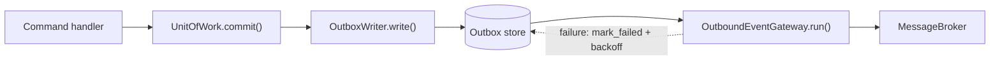

# OutboundEventGateway

> **Adoption Level:** 5 — Durable Outbound Delivery
> **Module:** `pydomain.cqrs.outbox` · `pydomain.infrastructure.message_broker`

## What is the OutboundEventGateway?

The **OutboundEventGateway** delivers integration events that were persisted *before* delivery was attempted. It is the outbound counterpart to [`InboundEventGateway`](inbound-event-gateway.md): where the inbound gateway turns broker messages into domain events, the outbox path turns domain events into durable outbound messages.

It is one half of a pair. [`OutboxWriter`](#the-write-side-outboxwriter) writes integration events into an outbox in the same transaction as the aggregate change; the gateway drains that outbox and publishes what it finds.



## Why It Exists

Before this mechanism, the only way to publish an integration event was to write a domain event handler that constructed one and called [`MessageBroker`](message-broker.md)`.publish()`. That path has three defects:

1. **It runs after commit**, outside the transaction. A crash between commit and publish loses the message permanently.
2. **`EventBus` swallows handler exceptions** ([ADR-046](../../../adr/ADR-046-event-handlers-fail-independently.md)). A broker outage would be logged and the message silently dropped — a *successful* command with a lost event.
3. **A broker outage becomes a write outage** if you publish inside `commit()` instead, because the commit now depends on the broker being reachable.

The outbox removes all three: the event is durable before delivery is attempted, delivery is retried until it succeeds, and the transaction never depends on the broker.

## How It Works

**Write path — inside the transaction.** During `commit()`, after domain events are collected and stamped, `_write_outbox()` translates them into outbox entries and appends them. [`AbstractUnitOfWork`](../cqrs/unit-of-work.md) implements this for you: pass an [`OutboxWriter`](#the-classes) to the constructor and no override is needed.

```python
class AppUnitOfWork(AbstractUnitOfWork):
    def __init__(self, session: AsyncSession, writer: OutboxWriter) -> None:
        super().__init__(outbox_writer=writer)
        self._session = session
        self._repos = {"orders": OrderRepository(session)}
```

The entries commit atomically with the aggregate state. Either both are persisted, or neither is.

**Delivery path — outside the transaction.** `OutboundEventGateway.run()` polls the outbox. For each fetched entry it resolves the integration class from the entry's `topic`, rehydrates the stored payload with `model_validate()`, publishes, and marks the entry published. Only a successful publish marks an entry delivered.

The gateway is domain-ignorant: it knows topics and `IntegrationEvent` classes, never domain types.

## The Classes

| Class | Role |
|---|---|
| [`OutboxEntry`](#) | Frozen record of one integration event awaiting publication: `message_id`, `topic`, `payload`, `event_version`, `attempts`, `occurred_at`, and tracing IDs |
| `OutboxStore` | Protocol for persisting the outbox — `append`, `fetch_unpublished`, `mark_published`, `mark_failed`, `mark_dead_lettered` |
| `OutboundEventRegistry` | Maps domain event types to an `IntegrationEvent` class, a topic, and a **pure** translator |
| `OutboxWriter` | The write-side join. Translates collected domain events and appends the result |
| `OutboundEventGateway` | The delivery relay. Fetches, rehydrates, publishes, marks |

## Failure Handling

Every failure leaves the entry **unpublished** and requeues it with capped exponential backoff, until the entry's retry budget is spent — then it is **dead-lettered**.

| Failure mode | Behaviour | Recovery |
|---|---|---|
| Broker unavailable / confirm timeout | `mark_failed`, backoff | Retry until the budget is spent |
| Broker nack | `mark_failed`, backoff | Retry until the budget is spent |
| Unknown topic (no registration) | Log error, `mark_failed` | Retry until the budget is spent |
| Payload fails `model_validate` | Log error, `mark_failed` | Retry until the budget is spent |
| Retry budget exhausted | `mark_dead_lettered` at `ERROR` level | Dead-lettered — replayable after a fix |

A failed entry never blocks the rest of the batch, and `stop()` drains the in-flight pass before returning — so `bootstrap()` can stop the relay before the broker with no publish left dangling.

### The retry budget

`OutboundEventGateway` takes `max_attempts` (default `10`). An entry that fails that many deliveries is dead-lettered: it stops being fetched, is never reported as published, and remains visible for inspection and manual replay. `max_attempts=None` retries forever.

The budget is **uniform** — the relay does not decide which failures are worth retrying, because it cannot know. An unknown topic is usually recoverable by deploying the missing translation and a validation failure is usually terminal, but the exception type is a property of the broker adapter, not of the message's future deliverability. A single bounded budget gives every recoverable failure the full ten attempts to recover in, and still reaches a terminal state for rows that are genuinely broken.

The point of dead-lettering is that it stops a poison row from consuming a slot in every fetch forever. Without it, a permanently broken row competes with new rows for `batch_size` on every pass.

> **⚠️** Dead-lettering is an **operational obligation**, not an optimisation. A dead letter nobody watches is worse than a row that keeps retrying. Alert on the `ERROR` log, and know how to replay.

## Design Decisions

> **📌 ADR-063**: [Outbound Event Gateway and Transactional Outbox](../../../adr/ADR-063-outbound-event-gateway-and-outbox.md) — the outbox stores serialized *integration* events, and translation happens at **write** time so the stored row is the wire format.

> **📌 ADR-064**: [`OutboxWriter` — Library-Owned Write-Side Join by Composition](../../../adr/ADR-064-outbox-writer-composition.md) — the write-side join is a composable collaborator, not a `UnitOfWork` base class.

> **📌 ADR-065**: [Outbox Retry Policy and Dead-Letter Queue](../../../adr/ADR-065-outbox-retry-policy-and-dead-letter.md) — why the retry budget is bounded and uniform rather than classifying failures.

> **📌 ADR-001**: [Protocol over ABC for Interfaces](../../../adr/ADR-001-protocol-over-abc-for-interfaces.md) — why there is no `OutboxUnitOfWork` to inherit from.

Two decisions are worth understanding because they are easy to assume wrongly:

- **Translation happens at write time, not delivery time.** If the outbox stored domain events and the relay translated them, an already-stored row would be re-interpreted by whatever code runs at delivery — replay instability in an at-least-once queue. It would also require `EventRegistry`-based type resolution, which ADR-060 [rejects for gateways](../../../adr/ADR-060-inbound-event-gateway.md). Because translation happens at write time, the stored row *is* the wire format, and serialization needs no conversion layer: `IntegrationEvent` is primitives-only by validation ([ADR-022](../../../adr/ADR-022-integration-events-primitive-payloads.md)).
- **The relay is not an `EventBus` handler.** `EventBus` logs and swallows handler exceptions by design; a non-replayable side effect must not run under that policy, so the gateway is its own pump.

## Relationship to Other Concepts

- **[Unit of Work](../cqrs/unit-of-work.md)** — `_write_outbox()` is the seam. Pass an `OutboxWriter` to the constructor and it is wired for you; without one, nothing is written and the relay polls an empty outbox forever.
- **[Integration Events](../cqrs/integration-events.md)** — the payload type the outbox stores.
- **[MessageBroker](message-broker.md)** — transport. The gateway publishes through it and never replaces it.
- **`OutboundEventRegistry` vs `EventRegistry`** — different tools. `EventRegistry` resolves serialized *domain* events by type name and is for event stores and weak-schema migration. The outbound registry resolves *integration* events by **topic**, following the flat payload pattern.

## Common Pitfalls

> **⚠️ Constructing the UoW without a writer.** `_write_outbox()` is a no-op when no `OutboxWriter` was passed to `super().__init__()`, and nothing warns you — the gateway runs, finds an empty outbox, and reports healthy. Pass the writer, or override the hook. See the [how-to guide](../../how-to/infrastructure/configure-outbound-event-gateway.md).

> **⚠️ Impure translators.** Translators run *inside the database transaction*. Calling a downstream service to enrich an event holds the transaction open and can deadlock under load. Translation must be a pure function of the domain event.

> **⚠️ Removing a translation registration while unpublished rows exist.** Those rows become undeliverable until the registration returns. Drain the outbox before deleting a registration.

> **⚠️ Treating delivery as exactly-once.** It is at-least-once. A crash between publish and `mark_published` produces a duplicate. Consumers must deduplicate on `message_id` — `ProcessedMessageStore.check_and_set` is the intended mechanism.

> **⚠️ Assuming the gateway guarantees ordering.** It publishes in fetch order per pass, but no global ordering contract is expressed. Do not build cross-event ordering guarantees on it.

> **⚠️ Setting `max_attempts=None` without monitoring.** Retrying forever is a legitimate choice when a broker outage is expected to be long, but it restores the problem dead-lettering solves: a row that can never be delivered is fetched, fails, and is rescheduled on every pass, indefinitely, and nothing ever tells you.

## Next steps

- **[How to configure the outbound event gateway](../../how-to/infrastructure/configure-outbound-event-gateway.md)** — wiring, registration, and the `OutboxWriter`
- **[Integration Events](../cqrs/integration-events.md)** — the payload type
- **[Message Broker](message-broker.md)** — the transport the gateway publishes through
- **[Unit of Work](../cqrs/unit-of-work.md)** — where the write happens
